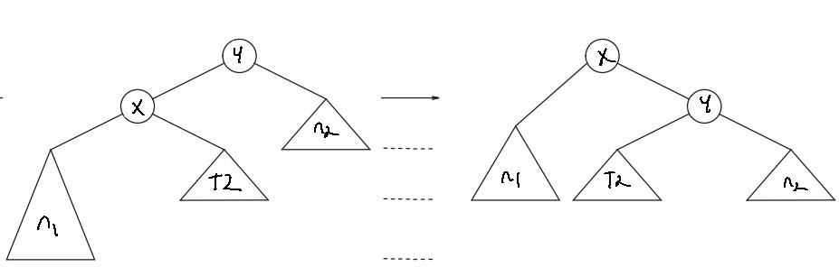
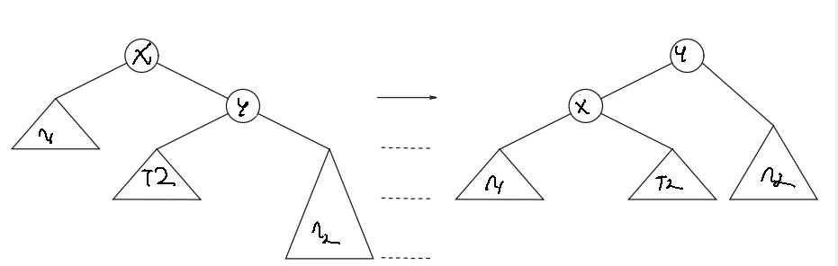
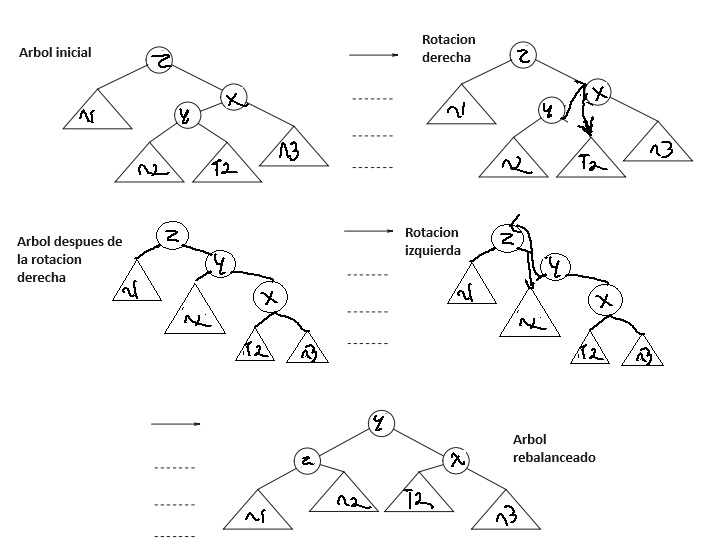
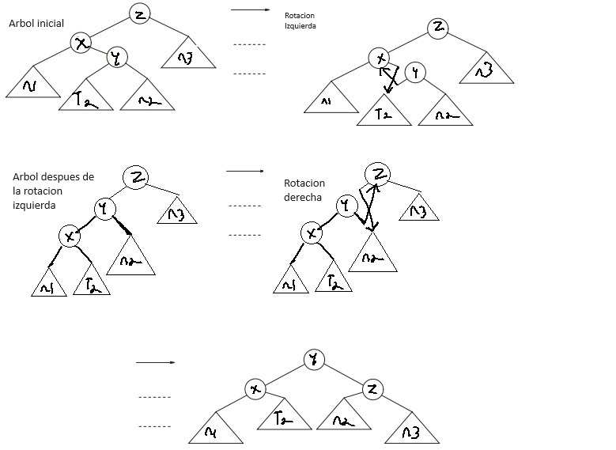

# Árbol AVl

Un árbol AVL (Abelson-Velskii and Landis) es un árbol de búsqueda binaria el cual cuenta con una condición de balance, este balance se asegura que la profundidad del árbol es de $O(LogN)$, aunque en realidad suele ser un poco mayor.<br>

Otra condición de balance implica que cada nodo debe tener sub-arboles izquierdos y derechos de la misma altura. Con este principio los únicos arboles que pueden estar balanceados son arboles con $2^k - 1$ nodos. Por lo cual la condición no puede ser tan rígida.<br>

En este sentido un árbol AVL es idéntico a un árbol de búsqueda  binaria con la diferencia con que la diferencia de altura entre los nodos izquierdos y derechos debe ser  menor a 1. La altura de un árbol vació es de -1.<br>

Todas las operaciones en un árbol AVL son posibles con un tiempo de $O(logN)$, excepto por la inserción y eliminación.<br>
Para realizar una inserción o eliminación, se necesita actualizar la información de balance de los nodos en el camino de regreso a la raíz, ya que de otra forma se podría eliminar la propiedad del árbol AVL.<br>

## Clase anidada nodo 

```c++
class Node {
public:
    T data; //Información que guarda el nodo
    int height; //Altura a la que se encuentra el nodo
    std::shared_ptr<Node<T>> left; //Puntero inteligente a su hijo izquierdo
    std::shared_ptr<Node<T>> right; //Puntero inteligente a su hijo derecho

    //Constructor explicito
    //Recibe un parámetro, data que se guarda en la variable data
    //El resto de datos quedan por defecto
    Node(T data) : data(data), height(1), left(nullptr), right(nullptr) {}
};
```

Guarda información, la altura y dos punteros compartidos, uno a su hijo izquierdo y su hijo derecho.

### Constructor

Cuenta con un constructor explicito que recibe información, pone su altura a 1 y deja sus hijos como nulos.

## Miembros 
```c++
std::shared_ptr<Node<T>> root;
```
Solo cuenta con un miembro un puntero inteligente al nodo raíz

## Constructor árbol AVL  
```c++ 
AVLTree(): root(nullptr) {} // Constructor implícito, guarda el puntero raíz como nulo
```

## Funciones

### Agregar 

```c++
void add(T data) {
        root = insert(root, data);
    }
```
Método publico para agregar un nodo.<br>
Llama al método privado insertar <br>

### Insertar

```c++
    std::shared_ptr<Node<T>> insert(std::shared_ptr<Node<T>> node, T data) {
        //Una vez llegado a un puntero nulo de un nodo hoja se crea un nuevo nodo con la información pasada
        if (node == nullptr){
            return (newNode(data));
        }
    }
```
Función privado Insertar, busca un nodo hoja e inserta un nuevo nodo 

### Imprimir 

```c++
    void print() {
        //Si el árbol no esta vació
        if (root != nullptr) {
            print(root, 0);
        } 
        //Si el árbol esta vació
        else {
            std::cout << "The tree is empty." << std::endl;
        }
    }
```
Si el árbol no se encuentra vació llama a la función privado imprimir.

###  Imprimir (privado)

```c++
     //Función recursiva para imprimir
    //Recibe un puntero a un nodo y una indentation
    void print(std::shared_ptr<Node<T>> node, int indent) {
        if(node) {
            //Sigue el camino del árbol derecho
            if(node->right) {
                print(node->right, indent + 8);
            }
            //Pone el indent antes de imprimir
            if (indent) {
                std::cout << std::setw(indent) << ' ';
            }
            //Imprime el camino del árbol derecho 
            if (node->right) {
                std::cout << " / (Right of " << node->data << ")\n" << std::setw(indent) << ' ';
            }
            std::cout << node->data << "\n" ;
            //Sigue e imprime el camino izquierdo del árbol
            if (node->left) {
                std::cout << std::setw(indent) << ' ' << " \\ (Left of " << node->data << ")\n";
                print(node->left, indent + 8);
            }
        }
    }
```
Busca recursivamente el camino derecho de un árbol y posteriormente lo imprime usando una indentation de 8 * la profundidad del nodo, siendo que el nodo raíz tiene una indentation de 0.<br>
Posteriormente se imprime el camino izquierdo siguiendo los mismo principios de indentation. <br>
Los nodos derechos se imprimen desde hoja a raíz mientras los izquierdos es de raíz a hoja.<br>

### Nuevo nodo (privado)
```c++
  std::shared_ptr<Node<T>> newNode(T data) {
        return std::make_shared<Node<T>>(data);
    }
```

Crea un puntero al nuevo nodo.<br>

### Rotación derecha (privado)

```c++
    //Rotación derecha para rebalance
    //Recibe el nodo sub-raíz "y" a rebalance
    std::shared_ptr<Node<T>> rightRotate(std::shared_ptr<Node<T>> y) {
        
        std::shared_ptr<Node<T>> x = y->left; //Guardamos el hijo izquierdo de "y" con el nombre "x"
        std::shared_ptr<Node<T>> T2 = x->right; //Guardamos el hijo derecho de "x" con el nombre "T2"

        x->right = y; //Hacemos que el hijo derecho de "x" sea "y"
        y->left = T2; //Hacemos que el hijo izquierdo de "y" sea "T2"

        y->height = max(height(y->left), height(y->right))+1; //Actualizamos la altura de y
        x->height = max(height(x->left), height(x->right))+1; //Actualizamos la altura de x

        //Rebalances el árbol y regresamos el nuevo nodo sub-raíz "x"
        return x;
    }
```
Representación visual de una rotación derecha


Se realiza cuando un después de una inserción o eliminación en la que el cambio de balance se vuelve *mayor a 1* y la información modificada es *menor a la del sub-árbol izquierdo* haciendo que el problema de balance se encuentre en el sub-árbol izquierdo de un hijo izquierdo, necesitando girarlo a la derecha para compensar.

### Rotación izquierda (privado)
```c++
 //Rotación izquierda para rebalance
    //Recibe el nodo sub-raíz "x" a rebalance
    std::shared_ptr<Node<T>> leftRotate(std::shared_ptr<Node<T>> x) {
        std::shared_ptr<Node<T>> y = x->right; //Guardamos el hijo derecho de "x" con el nombre "y"
        std::shared_ptr<Node<T>> T2 = y->left; //Guardamos el hijo izquierdo de "y" con el nombre "T2"

        y->left = x; //Hacemos que el hijo izquierdo de "y" sea "x"
        x->right = T2;//Hacemos que el hijo derecho de "x" sea "T2"

        x->height = max(height(x->left),height(x->right))+1; //Actualizamos la altura de x
        y->height = max(height(y->left),height(y->right))+1; //Actualizamos la altura de y

        //Rebalances el árbol y regresamos el nuevo nodo sub-raíz "y"
        return y;
    }
```

Representación visual de una rotación izquierda.<br>



Se realiza cuando un después de una inserción o eliminación el cambio de balance se vuelve *menor a -1* y la información modificada es *mayor a la del sub-árbol derecho* haciendo que el problema de balance se encuentre en el sub-árbol derecho de un hijo derecho, necesitando girarlo a la izquierda para compensar.<br>

### Rotación derecha-izquierda

Representación visual de una rotación derecha-izquierda.<br>



Se realiza cuando un después de una inserción o eliminación el cambio de balance se vuelve *menor -1* y la información modificada es *menor a la del sub-árbol derecho* haciendo que el problema de balance se encuentre en el sub-árbol izquierdo de un hijo derecho, necesitando girar el sub-árbol derecho a la derecha y posteriormente el hijo izquierdo a la izquierda.<br>

### Rotación derecha-izquierda

Representación visual de una rotación izquierda-derecha.<br>


Se realiza cuando un después de una inserción o eliminación el cambio de balance se vuelve *mayor a 1* y la información modificada es *mayor a la del sub-árbol izquierdo* haciendo que el problema de balance se encuentre en el sub-árbol derecho de un hijo izquierdo, necesitando girar el sub-árbol izquierdo a la izquierda y posteriormente el hijo derecho a la derecha.<br>

### Obtener balance (privado)

```c++
int getBalance(std::shared_ptr<Node<T>> N) {
        
        //Si el nodo es hoja su valor de equilibrio es 0
        if (N == nullptr){return 0; }

        //Si no lo es se obtiene con la altura del sub-árbol izquierdo menos la altura del sub-árbol derecho
        else{ return height(N->left) - height(N->right); }    
        
    }
```

Regresa el factor de balance de un nodo restando la altura del del hijo izquierdo menos la del derecho.<br>
Los resultados se interpretan de la siguiente manera: 
* -1 a 1: El nodo se encuentra en balance
* <-1 Desbalance del lado derecho
* \>1 Desbalance del lado izquierdo

### Insertar (privado)

```c++
    //Función interna Insertar
    std::shared_ptr<Node<T>> insert(std::shared_ptr<Node<T>> node, T data) {
        //Una vez llegado a un puntero nulo de un nodo hoja se crea un nuevo nodo con la información pasada
        if (node == nullptr){
            return (newNode(data));
        }

        //Si el nodo no es nulo y si información es menor a la del nodo se continua con una búsqueda recursiva por el nodo izquierdo
        if (data < node->data){
            node->left = insert(node->left, data);
        }

        //Si el nodo no es nulo y si información es mayor a la del nodo se continua con una búsqueda recursiva por el nodo derecho
        else if (data > node->data){
            node->right = insert(node->right, data);
        }

        //Si ya existe un nodo con dicha información se regresa ese nodo
        else{
            return node;
        }
    }
```
Primero se busca la posición del nuevo nodo a insertar mediante la comparación de sus información con la del nodo.<br>
Si se encuentra un nodo el cual ya contenga la información no se hace nada.<br>
Si no se encuentra un nodo que contenga dicha información se coloca en su posición correspondiente.<br>

```c++
//Se calcula la altura del nodo
        node->height = 1 + max(height(node->left), height(node->right));

        //Se obtiene el factor de equilibrio del nuevo nodo
        int balance = getBalance(node);

        //Revision de equilibrio

        //Caso de desbalance izquierda-izquierda
        if (balance > 1 && data < node->left->data)
            return rightRotate(node);

        //Caso de desbalance derecha-derecha
        if (balance < -1 && data > node->right->data)
            return leftRotate(node);

        //Caso de desbalance izquierda-derecha
        if (balance > 1 && data > node->left->data) {
            node->left = leftRotate(node->left); //Realizamos una rotación izquierda en el hijo izquierdo de la sub-raíz
            return rightRotate(node); //Realizamos una rotación derecha en la sub-raíz
        }

        //Caso de desbalance derecha-izquierda
        if (balance < -1 && data < node->right->data) {
            node->right = rightRotate(node->right); //Realizamos una rotación derecha en el hijo derecho de la sub-raíz
            return leftRotate(node); //Realizamos una rotación izquierda en la sub-raíz
        }

        //No hay problema de balance
        return node;
```

Se recalcula la altura del nodo y se obtiene su balance, si existe un problema de balance se resuelve mediante la rotación apropiada, si no hay ningún problema de balance se termina sin ninguna rotación adicional.

### Buscar el valor mínimo (privado)

```c++
    //Buscar el nodo de menor valor
    std::shared_ptr<Node<T>> minValueNode(std::shared_ptr<Node<T>> node) {
        std::shared_ptr<Node<T>> current = node;

        //Se avanza continuamente por el nodo izquierdo hasta llegar a la hoja mas izquierda (valor mínimo del sub-árbol)
        while (current->left != nullptr){
            current = current->left;
        }
            
        //Se regresa el nodo encontrado
        return current;
    }
```

Se avanza constantemente por el hijo izquierdo hasta llegar al nodo mas izquierdo, el cual contiene el valor mínimo.

### Buscar valor máximo (privado)

```c++
    //Buscar el nodo de mayor valor
    std::shared_ptr<Node<T>> maxValueNode(std::shared_ptr<Node<T>> node) {
        std::shared_ptr<Node<T>> current = node;

        //Se avanza continuamente por el nodo derecho hasta llegar a la hoja mas derecha (valor máximo del sub-árbol)
        while (current->right != nullptr){
            current = current->right;
        }
            
        //Se regresa el nodo encontrado
        return current;
    }
```
Se avanza constantemente por el hijo derecho hasta llegar al nodo mas derecho, el cual contiene el valor máximo.

### Eliminar nodo 

```c++
    std::shared_ptr<Node<T>> deleteNode(std::shared_ptr<Node<T>> root, T data) {
        
        //Si no existe el nodo se regresa sin eliminar nada
        if (!root){ return root; }    

        //Busca el nodo a borrar por el sub-árbol izquierdo
        if (data < root->data) {
            root->left = deleteNode(root->left, data);
        }
        //Busca el nodo a borrar por el sub-árbol derecho
        else if(data > root->data) {
            root->right = deleteNode(root->right, data);
        }

        //Reacomodo de los nodos hijos
        else {
            //Si solo se tiene un hijo, ese hijo toma el lugar del padre
            if(!root->left || !root->right) {
                root = (root->left) ? root->left : root->right;
            }
            //Si tiene dos hijos, busca el nodo de mor valor en el sub árbol derecho y lo convierte en la nueva sub-raíz
            else {
                std::shared_ptr<Node<T>> temp = minValueNode(root->right);
                root->data = temp->data;
                //Elimina el nodo original que se convirtió en la nueva sub-raíz
                root->right = deleteNode(root->right, temp->data);
                temp.reset();
            }
        }

        //No se encontró nodo con la información solicitada, nada que borrar
        if(!root){ return root; }
```

Se busca el nodo que contenga la información pasada como parámetro. Se busca de manera recursiva por el sub-árbol izquierdo o derecho según el caso de comparación. <br>
Si el nodo no existe no se hace nada.<br>
Si el nodo existe y tiene 0 o 1 hijos, el hijo existente toma el lugar del padre, sino simplemente se elimina.<br>
Si el nodo tiene mas de 2 hijos, se elimina y se busca el menor de elemento del sub-árbol derecho, el cual es el menor elemento que sigue siendo mayor que todos los elementos del sub-árbol izquierdo por lo cual es el candidato optimo para tomar al lugar del nodo eliminado, posteriormente se busca el nodo que antiguamente contenía la información y se elimina.

```c++
        //Se calcula la altura del nodo
        root->height = 1 + max(height(root->left), height(root->right));

        //Se obtiene el factor de equilibrio del nuevo nodo
        int balance = getBalance(root);

        //Revision de equilibrio

        //Caso de desbalance izquierda-izquierda
        if (balance > 1 && getBalance(root->left) >= 0){
            return rightRotate(root);
        }

        //Caso de desbalance derecha-derecha
        if (balance < -1 && getBalance(root->right) <= 0){
            return leftRotate(root);
        }

        //Caso de desbalance izquierda-derecha
        if (balance > 1 && getBalance(root->left) < 0) {
            root->left = leftRotate(root->left); //Realizamos una rotación izquierda en el hijo izquierdo de la sub-raíz
            return rightRotate(root); //Realizamos una rotación derecha en la sub-raíz
        }

        //Caso de desbalance derecha-izquierda
        if (balance < -1 && getBalance(root->right) > 0) {
            root->right = rightRotate(root->right);//Realizamos una rotación derecha en el hijo derecho de la sub-raíz
            return leftRotate(root); //Realizamos una rotación izquierda en la sub-raíz
        }

        //No hay problema de balance
        return root;
    }
```

Se recalcula la altura del nodo y se obtiene su balance, si existe un problema de balance se resuelve mediante la rotación apropiada, si no hay ningún problema de balance se termina sin ninguna rotación adicional.<br>


### Altura (privado)

```c++
    //Altura
    //Si el nodo existe regresa su altura
    //Si no existe regresa 0
    int height(std::shared_ptr<Node<T>> N) {
        if (N == nullptr){ return 0; }
        else{ return N->height; }        
    }
```
Si un nodo existe regresa su altura, de lo contrario regresa 0.<br>

### Máximo (privado)

```c++
    //Función comparador
    //Regresa el mayor de los dos valores pasados
    int max(int a, int b) {
        return (a > b)? a : b;
    }
```
Función comparador, regresa el valor máximo de los 2 valores pasados como parámetros.