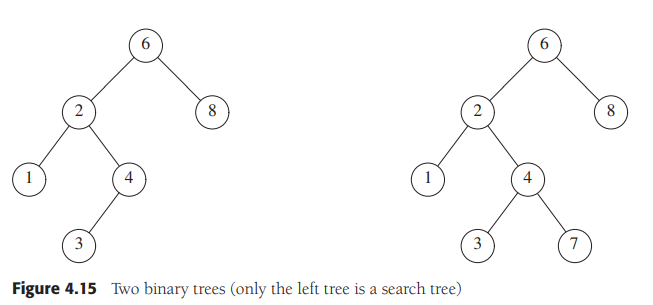
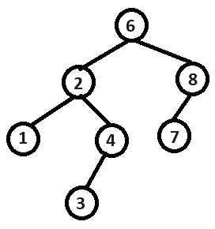

# Arboles <br>

Con una gran cantidad de datos, el tiempo de acceso a las listas vinculadas se convierte en una restricción. Por lo que los arboles son una estructura que nos ayuda con el tiempo, al tener una complejidad de $O(logN)$. <br>

## Preliminares <br>

Un árbol puede ser definido como una colección de nodos, en la que si este no se encuentra vació, consiste de un nodo ***r*** o ***raíz*** el cual cuenta con 0 o mas nodos que forman sub-arboles 


Los nodos que surgen a partir de otros son llamados *hijos* (*child* en ingles), a su vez el nodo del que estos salen es llamado *padre* (*parent*), mientras que los nodos que salen del mismo nodo padre son llamados *hermanos* (*siblings*).<br>
Todos los nodos, excepto el raíz, tienen un único nodo padre, mientras que los nodos pueden tener multiples nodos o ninguno. En caso de no tener ningún nodo a estos se les denominan como *hojas* (*leaves*). De la misma manera los hijos de un nodo hijo serán *nietos* para su nodo padre, mientras que este sera el nodo *abuelo* para los mismos.<br>

Un *camino* de un nodo a otro es definido como una secuencia de nodos n<sub>1</sub>, n<sub>2</sub>, ... n<sub>k</sub>.  
La *longitud* del camino es el numero de bordes en el camino. <br>  
La *profundidad* de un nodo es lo largo del camino desde el nodo raíz hasta dicho nodo, siendo asi que el nodo raíz tiene una profundidad de 0. <br>
La *altura* de un nodo *n* es la longitud del camino del nodo *n* al nodo hoja mas lejano. <br>


>Complementario:
> "La ***altura*** de un nodo en un árbol se define como la longitud del camino
más largo que comienza en el nodo y termina en una hoja. La altura de un
nodo hoja será de cero, y la altura de un nodo se puede calcular sumando
uno a la mayor altura de sus hijos..."<br>
>"La ***altura de un árbol*** se define como la altura de su raíz..."<br>
> La ***profundidad de un nodo*** se define como la longitud del camino (único)
que comienza en la raíz y termina en el nodo. La profundidad de la raíz es
cero, y la profundidad de un nodo se puede calcular como la profundidad
de su padre mas uno... A la profundidad de un nodo también se la denomina ***nivel del nodo*** en el
árbol.<br>
>[1]	I. T. I. Gestión, U. De, y V.-D. De Informática, “Estructuras de Datos -Curso 02/03”, Uva.es. [En línea]. Disponible en: https://www.infor.uva.es/~cvaca/asigs/transp3.pdf. [Consultado: 23-oct-2023]. <br>


### Implementación <br>

Debido a que cada nodo, ademas de su información, debe contener un vinculo a sus hijos y hermanos y que estos pueden variar, una forma de declarar los nodos para un árbol es la siguiente:
```c++
template<typename Type>
struct TreeNode{
    Type content;
    TreeNode *firstChild;
    TryNode *nextSibling;
}
```

Con esta implementación podemos guardar espacio al solo usar los nodos necesarios a la vez que permitimos agregar cuantos se necesiten. <br>

### Arboles transversales y su aplicación <br>

Los arboles tienen una gran variedad de aplicaciones, una de las mas populares y cotidianamente utilizadas son los sistemas de archivos tanto de *UNIX* como de *DOS*, en estos se encuentra un directorio raíz, el cual contiene dentro de si directorios (Los cuales guardan archivos e incluso otros directorios.) y archivos, cumpliendo estos asi con las características de los arboles, donde el camino o *path* a cada nodo, siendo asi que dos archivos se pueden llamar de la misma manera y no haber conflicto ya que su *path* es diferente. <br>

#### Pre-orden transversal <br>

En este tipo de orden, el trabajo del nodo es ejecutado antes (*pre*) que sus hijos sean procesados. Siendo asi que primero se trabaja la raíz y después se hace todo el camino hasta las hojas. <br>

#### Post-orden transversal <br>

En este orden se ejecuta el trabajo de un nodo hasta después (*post*) de que sus hijos sean procesados. De esta manera se evalúan desde las hojas hasta llegar a la raíz.<br>

## Arboles binarios <br>

Los arboles binarios son aquellos en los que los nodos no pueden llegar a tener mas de 2 nodos hijos. Estos arboles consisten de un nodo raíz y máximo dos hijos, los cuales cumplen con las mismas características del nodo raíz.<br>

La profundidad de estos, en promedio suele ser de $O(\sqrt{N})$, mientras que para los arboles de búsqueda binaria suele ser de $O(logN)$. Sin embargo la profundidad de esto puede llegar a ser hasta de $N-1$.<br>

### Implementación <br>

Debido a que este tipo de nodo unicamente cuneta con dos hijos, podemos mantener referencias a ambos dentro del mismo. Por lo que esta estructura guarda un objeto y 2 referencias a sus hijos. (punteros a L y R).

### Ejemplo: Arboles de expresiones 


```c++
//Elementos básicos de un nodo binario
template<typename Type>
struct BinaryNode{
    Type data; //Datos que guarda el nodo
    BinaryNode *left; //Hijo izquierdo
    BinaryNode *right; //Hijo derecho
}
```

El árbol mostrado arriba corresponde a un *Árbol de expresiones*, en donde los nodos hoja son son los operandos, como constantes, variables etc.. Mientras que los otros nodos contienen los operadores.<br>

#### Árbol a expresión
Estos arboles se resuelven de manera recursiva los sub-arboles de derecha a izquierda. En el caso de la imagen se realiza 3 + ((5+9)*2), esta forma de convertir un árbol a una expresión se conoce como: "***inorder transversal***".<br>

Una forma alternativa es imprimir de manera recursiva los sub-arboles izquierdos y después el operador. Tomando como ejemplo la imagen de ejemplo, la expresión seria: 3 5 9 + 2 * +, esta forma de convertir un árbol a una expresión se conoce como: "***postorder transversal***".<br>

Una tercera forma de imprimir seria, primero los operadores y después de manera recursiva los sub-arboles izquierdos y luego derechos, de esta forma nuestra expresión seria + 3 * + 5 9 2, esta forma de convertir un árbol a una expresión se conoce como: "***preorder transversal***".<br>

#### Expresión a árbol

Partiendo de una expresión del tipo *postfix* el algoritmo para generar un árbol consta de lo siguiente: <br>
* Si el elemento es un numero (1, 400, PI...), se agrega a un *stack*
* Si el elemento es un operador (*,+,-,/...), los dos últimos elementos del *stack* pasaran a ser sus hijos y el operador pasara a ser el ultimo elemento del *stack*.

## Arboles de búsqueda binaria <br>

Una característica importantes de los arboles binarios, es su aplicación en búsquedas.<br>

Debido a esto para que un árbol binario pueda ser un árbol de búsqueda binaria, este debe cumplir con lo siguiente: para todos los elementos de un nodo *X* , todos los elementos en el sub-árbol izquierdo deberán ser menores, mientras que todos los elementos en el sub-árbol derecho deberán ser mayores. <br>



En base a las reglas de al búsqueda binaria, el árbol de la izquierda cumple con las características, mientras que el de la derecha, no lo hace, ya que si bien 7>4, el problema caen en que 7 se encuentra en el sub-árbol izquierdo de la raíz (6), lo que implicaría que 7<6. lo cual es falso, por lo que no puede ser un árbol binario. Pero si quisiéramos agregar el nodo 7 y mantener la estructura de árbol binario se vería de la siguiente forma: <br>



<br>
Debido a que estas comparaciones se escriben de forma recursiva, lo común es que la complejidad de la búsqueda, en promedio sea de $O(logN)$.<br>

### Interfaz de un Árbol de Búsqueda Binaria <br>


```c++
 template <typename Comparable>
2 class BinarySearchTree
3 {
4 public:
5 BinarySearchTree( );
6 BinarySearchTree( const BinarySearchTree & rhs );
7 BinarySearchTree( BinarySearchTree && rhs );
8 ~BinarySearchTree( );
9
10 const Comparable & findMin( ) const;
11 const Comparable & findMax( ) const;
12 bool contains( const Comparable & x ) const;
13 bool isEmpty( ) const;
14 void printTree( ostream & out = cout ) const;
15
16 void makeEmpty( );
17 void insert( const Comparable & x );
18 void insert( Comparable && x );
19 void remove( const Comparable & x );
20
21 BinarySearchTree & operator=( const BinarySearchTree & rhs );
22 BinarySearchTree & operator=( BinarySearchTree && rhs );
23
24 private:
25 struct BinaryNode
26 {
27 Comparable element;
28 BinaryNode *left;
29 BinaryNode *right;
30
31 BinaryNode( const Comparable & theElement, BinaryNode *lt, BinaryNode *rt )
32 : element{ theElement }, left{ lt }, right{ rt } { }
33
34 BinaryNode( Comparable && theElement, BinaryNode *lt, BinaryNode *rt )
35 : element{ std::move( theElement ) }, left{ lt }, right{ rt } { }
36 };
37
38 BinaryNode *root;
39
40 void insert( const Comparable & x, BinaryNode * & t );
41 void insert( Comparable && x, BinaryNode * & t );
42 void remove( const Comparable & x, BinaryNode * & t );
43 BinaryNode * findMin( BinaryNode *t ) const;
44 BinaryNode * findMax( BinaryNode *t ) const;
45 bool contains( const Comparable & x, BinaryNode *t ) const;
46 void makeEmpty( BinaryNode * & t );
47 void printTree( BinaryNode *t, ostream & out ) const;
48 BinaryNode * clone( BinaryNode *t ) const;
49 };
```

### Implementación de un Árbol de Búsqueda Binaria <br>

#### template \<typename Comparable> <br>

Para que el árbol de búsqueda binario pueda funcionar, el tipo pasado mediante la *template* debe contar con el operador "***<***". Otra forma de manejar las comparaciones es mediante una función objeto, la cual al ser pasada como parámetro pueda definir la forma en la que se deben comparar los datos de la *template*. 

>Un objeto de función, o functor, es cualquier tipo que implementa operator(). Este operador se conoce como el operador de llamada o a veces el operador de la aplicación. La biblioteca estándar de C++ usa objetos de función principalmente como criterios de ordenación para los contenedores y en algoritmos.
>
>Los objetos de función proporcionan dos ventajas principales en comparación con una llamada de función sencilla. La primera es que un objeto de función puede contener el estado. La segunda es que un objeto de función es un tipo y, por tanto, puede usarse como un parámetro de plantilla.<br>
>
>***Código de ejemplo***
>```c++
>class Functor
>{
>public:
>    int operator()(int a, int b)
>    {
>        return a < b;
>    }
>};
>
>int main()
>{
>    Functor f;
>    int a = 5;
>    int b = 7;
>    int ans = f(a, b);
>}
>```
>[2]	TylerMSFT, “Objetos de función en la biblioteca estándar de C++”, Microsoft.com. [En línea]. Disponible en: https://learn.microsoft.com/es-es/cpp/standard-library/function-objects-in-the-stl?view=msvc-170. [Consultado: 25-oct-2023].


#### *contains* <br>

Busca si un elemento existe. (regresa *verdadero*) o no (regresa *falso*) en un árbol. Esto mediante el uso de comparaciones y la estructura del árbol binario, donde el hijo izquierdo es menor que su padre y el derecho mayor.

```c++
public:

//Regresa verdadero si el elemento es encontrado
bool contains( const Comparable & x ) const{
    return contains( x, root );
}

/*
Método interno para buscar el elemento en un sub-árbol
x es el elemento a buscar
t es el nodo que funciona como raíz para el sub-árbol
*/
private: 
bool contains( const Comparable & x, BinaryNode *t ) const{
if( t == nullptr ){return false;} //Se ah pasado un nodo hoja, elemento no encontrado
else if( x < t->element ){return contains( x, t->left );} //El elemento x es menor al elemento de la raíz, se continuara buscando por el sub-árbol izquierdo
else if( t->element < x ){return contains( x, t->right );}//El elemento x es mayor al elemento de la raíz, se continuara buscando por el sub-árbol derecho
else{return true;} // Elemento encontrado
}
```


#### *findMin & findMax*

Estas rutinas buscan el menor y mayor elemento respectivamente, de un árbol y regresan un puntero hacia dicho nodo.<br>
Este método puede ser implementado tanto de manera recursiva como de manera no recursiva.

```c++
//Implementación recursiva con findMind

BinaryNode * findMin( BinaryNode *t ) const{
    if( t == nullptr ) {return nullptr;} //Si el árbol se encuentra vació regresa un puntero nulo
    if( t->left == nullptr ){return t;} //Si el nodo no posee un hijo izquierdo, significa que habremos llegado al valor mínimo
    return findMin( t->left );//Si aun se tiene un nodo hijo izquierdo se continua la búsqueda desde dicho nodo llamando recursivamente esta función, una vez encontrado se regresa el nodo
}
```

```c++
//Implementación NO recursiva con findMax

BinaryNode* findMax( BinaryNode *t ) const
{
    //Si el puntero no es nulo, se procede con la búsqueda
    if( t != nullptr ){
        while( t->right != nullptr ) {t = t->right;} //Se moverá por el nodo derecho hasta llegar al ultimo, siendo este el máximo
    }

    return t; //Se regresa un puntero al nodo encontrado
}
```

####  *insert*

La inserción es simple, primero, se realiza un *contains* para buscar si el elemento *X* a insertar existe o no en el árbol, si el elemento existe no se hace nada. Si no existe se inserta como hijo del ultimo nodo seguido en el camino del *contains*.<br>
Los duplicados pueden se manejados dejando un campo extra en el nodo para indicar la frecuencia de un elemento. Esto agrega mayor peso a los nodos y al árbol en general, pero es mejor que manejar duplicados.<br>  

```c++
//Insertar por referencia
void insert( const Comparable & x, BinaryNode *&t){
    if( t == nullptr ){t = new BinaryNode{ x, nullptr, nullptr };} //Si no encontramos un nodo vació, insertamos el nodo en dicha posición
    else if( x < t->element ){insert( x, t->left );} //Si el elemento X es menor al elemento del nodo lo insertamos como hijo izquierdo
    else if( t->element < x ){    insert( x, t->right );} //Si el elemento X es mayor al elemento del nodo lo insertamos como hijo derecho
    else; // Duplicado, no se hace nada
}

//Insertar por copia
void insert( Comparable && x, BinaryNode *&t){
    if( t == nullptr ) {t = new BinaryNode{ std::move( x ), nullptr, nullptr }; }//Si no encontramos un nodo vació, insertamos el nodo en dicha posición
    else if( x < t->element ){insert( std::move( x ), t->left );} //Si el elemento X es menor al elemento del nodo lo insertamos como hijo izquierdo
    else if( t->element < x ) {insert( std::move( x ), t->right );} //Si el elemento X es mayor al elemento del nodo lo insertamos como hijo derecho
    else; // Duplicado, no se hace nada
}
```

#### *remove*

Para eliminar un nodo, debemos tener varias consideraciones. <br>

* Si es un nodo hoja, el nodo puede ser eliminado inmediatamente.<br>
* Si el nodo tiene un solo hijo, el nodo sera borrado y su hijo pasara a tomar el lugar de su padre.<br>
* Si el nodo tiene 2 hijos, se usara la función findMin para encontrar el menor de los elementos, el cual tomara el lugar del elemento a borrar y su nodo original (un nodo hoja), sera borrado.<br>
* Si dentro del árbol se lleva un conteo de frecuencia de un elemento se bajara el numero de la frecuencia, si esta llega a 0, se realiza uno de los métodos de arriba.<br>
* *Lazy deletion*, se emplea cuando se prevea que el numero de eliminación sea pequeño, el nodo se deja en el árbol y solamente se marca como *borrado*.<br>

```c++
void remove( const Comparable & x, BinaryNode *&t){

    //Inicia búsqueda del elemento

    if( t == nullptr ){return;} // No se encontró el elemento, no se hace nada
    
    //Búsqueda recursiva del elemento por el sub-árbol de izquierdo
    if( x < t->element ){remove( x, t->left );}
    
    //Búsqueda recursiva del elemento por el sub-árbol de derecho
    else if( t->element < x ){remove( x, t->right );}

    //Una vez encontrado el elemento

    //Caso de 2 hijos
    else if( t->left != nullptr && t->right != nullptr ) {
        //Iguala el nodo actual al nodo menor del sub-árbol derecho
        t->element = findMin( t->right )->element;

        //Se busca el elemento menor del sub-árbol derecho y se elimina
        remove( t->element, t->right );
    }
    
    //Caso de 1 o 0 hijos
    else{
        //Se guarda el nodo a borrar
        BinaryNode *oldNode = t;

        //Si existe uno de los hijos se guarda en la posición del nodo padre
        t = ( t->left != nullptr ) ? t->left : t->right;

        //Se borra el nodo
        delete oldNode;
    }
}
```
#### Destructor

Como en el resto de estructuras ADT, primero se vacía completamente la estructura y después se destruye la estructura propiamente<br>

```c++
//Destructor
~BinarySearchTree(){
    makeEmpty();
}

//Método interno para vaciar el árbol
private:
void makeEmpty( BinaryNode * & t ){
    //Si el nodo actual no esta vació se llama de forma recursiva el método para destruir sus posibles hijos

    if( t != nullptr ){
        makeEmpty( t->left ); //Se ejecuta el método en el sub-árbol izquierdo
        makeEmpty( t->right ); //Se ejecuta el método en el sub-árbol derecho
        delete t; //Se elimina el nodo t0
    }

    //Se convierte el nodo en un puntero nulo
    t = nullptr;
}
```

#### Copy constructor

```c++
//Constructor por copia
BinarySearchTree( const BinarySearchTree & rhs ) : root{ nullptr }{
    //Se clonan todos los elementos del árbol rhs al árbol lhs
    root = clone( rhs.root );
}

//Método interno para copiar un árbol o sub-árbol
BinaryNode * clone( BinaryNode *t ) const{
    if( t == nullptr ){return nullptr;} //Si el nodo es nulo, se termina la copia del sub-árbol
    else{return new BinaryNode{ t->element, clone( t->left ), clone( t->right ) };} //Si el nodo existe, se continúan copiando los sub-arboles de sus hijos    
}
```

## Arboles AVL

Un árbol AVL (Abelson-Velskii and Landis) es un árbol de búsqueda binaria el cual cuenta con una condición de balance, este balance se asegura que la profundidad del árbol es de $O(LogN)$, aunque en realidad suele ser un poco mayor.<br>

Otra condición de balance implica que cada nodo debe tener sub-arboles izquierdos y derechos de la misma altura. Con este principio los únicos arboles que pueden estar balanceados son arboles con $2^k - 1$ nodos. Por lo cual la condición no puede ser tan rígida.<br>

En este sentido un árbol AVL es idéntico a un árbol de búsqueda  binaria con la diferencia con que la diferencia de altura entre los nodos izquierdos y derechos debe ser  menor a 1. La altura de un árbol vació es de -1.<br>

Todas las operaciones en un árbol AVL son posibles con un tiempo de $O(logN)$, excepto por la inserción y eliminación.<br>
Para realizar una inserción o eliminación, se necesita actualizar la información de balance de los nodos en el camino de regreso a la raíz, ya que de otra forma se podría eliminar la propiedad del árbol AVL.<br>

Para solucionar esto se puede realizar mediante una modificación llamada *rotación*. Esta afectara a los nodos que están en el camino de inserción del nodo.<br>

La inserción puede ocurrir en uno de cuatro casos:<br>
* En el sub-árbol izquierdo del hijo izquierdo
* En el sub-árbol derecho del hijo izquierdo
* En el sub-árbol izquierdo del hijo derecho
* En el sub-árbol derecho del hijo derecho

<br>

Estos a su vez, se agrupan en 2 casos:<br>
* El primero enn el que la inserción ocurre en "exterior" (derecha-derecha, izquierda-izquierda), este se soluciona mediante una **rotación simple**.
* El segundo es en el que la inserción ocurre en el "interior" (izquierda-derecha, derecha-izquierda), el cual se soluciona mediante una **rotación doble**.

### Rotación simple

Esta ocurre para solucionar una violación al balance del árbol AVL en un nodo insertado en el sub-árbol izquierdo del hijo izquierdo o el sub-árbol derecho del hijo derecho.<br>

La solución consiste en los siguientes pasos: <br>

* Tomar el nodo raíz del sub-árbol donde ocurrió el desbalance
* Si el desbalance ocurrió en el sub-árbol derecho del hijo derecho:
    * Convertir el sub-árbol izquierdo del hijo derecho del nodo sub-raíz en el hijo derecho del nodo sub raíz
    * Convertir el hijo derecho del nodo sub-raíz en la nueva raíz
    * Convertir el nodo sub-raíz original en el hijo izquierdo de la nueva sub-raíz
* Si el desbalance ocurrió en el sub-árbol izquierdo del hijo izquierdo:
    * Convertir el sub-árbol derecho del hijo izquierdo del nodo sub-raíz en el hijo izquierdo del nodo sub raíz
    * Convertir el hijo izquierdo del nodo sub-raíz en la nueva raíz
    * Convertir el nodo sub-raíz original en el hijo derecho de la nueva sub-raíz

### Rotación doble

Esta se realiza cuando una se causa una violación al balance AVl se realiza en el sub-árbol izquierdo del hijo derecho o en el sub-árbol derecho del hijo izquierdo.<br>

Para solucionar esto, se encuentra el nodo donde ocurre el desbalance, este nodo sera *k1*, el siguiente nodo en el camino sera *k3* y el siguiente sera *k2*.<br>

Ahora realizamos lo siguiente:
* *k2* pasara a ser el nodo sub-raíz del sub-árbol a reordenar
* *k1* pasara a ser el hijo izquierdo de *k2*
* *k3* pasara a ser el hijo derecho de *k2*
* Si *k2* tenia hijos:
    * Su hijo izquierdo pasara a ser el hijo derecho de *k1*
    * Su hijo derecho pasara a ser el hijo izquierdo de *k3*

> ### Rotaciones *extra* (porque el libro solo dio ejemplo y no explicación como o cuando)
> "Para conocer si un árbol AVL mantiene sus características de equilibrio es necesario conocer el ***Factor de equilibrio*** de cada nodo involucrado en el camino de una inserción o eliminación."
> "Para conocer este factor de equilibrio (***FE***),  se calcula: Profundidad del sub-árbol derecho menos profundidad del sub-árbol izquierdo."
> "Un árbol AVL equilibrado tiene todos sus nodos con un factor de equilibrio de {-1,0,1}."
> "Una rotación es una reestructuración local de un sub-árbol para mantener la propiedad de equilibrio del árbol"
> "Tras una operación de inserción/eliminación se realiza un re calculo de las alturas de los nodos del camino, teniendo en cuenta la nueva altura de cada sub-árbol"
> "Para rebalancear un árbol se requiere de una rotación, que puede ser simple o doble, ademas de en una dirección, derecha o izquierda."
>  "Si el nodo desequilibrado es a la izquierda (FE < -1), y su hijo izquierdo tiene el mismo signo (-), se hace una rotación simple a la derecha"
> "Si el nodo desequilibrado esta a la derecha y su hijo tiene el mismo signo (+), se hace una rotación simple a la izquierda"
> "Si el nodo desequilibrado es a la izquierda (FE < -1), y su hijo izquierdo tiene el distinto signo (+), se hace una rotación doble izquierda-derecha"
> "Si el nodo desequilibrado es a la derecha (FE>1) y su hijo tiene distinto signo (-) se realiza una rotación doble derecha-izquierda"
>
>[3]	MrRocket, “Árbol Avl de inserción y eliminación y ordenamiento”, 05-jul-2018. [En línea]. Disponible en: https://www.youtube.com/watch?v=UnhMzEaLDdw. [Consultado: 28-oct-2023].

## Splay trees

Los *splay trees* se basan en que una complejidad de $O(N)$ no es tan mala, en especial cuando no curre frecuente mente.

# Opinion critica

Los arboles, son el siguiente paso de las listas y sus variaciones. <br>
En estos podemos encontrar una estructuración mas compleja, ya que se puede considerar como listas con sub-listas, que pueden tener una cantidad infinita de sub-listas y por lo tanto de elementos.<br>

Esto puede llegar a ser beneficioso, sin embargo también puede ser caótico y complicado de ver y administras, ademas de la existencia de variaciones en la cantidad de nodos que puede llegar a tener un hijo, hace que se vuelva en una estructura complicada e ineficiente la cual se vuelve incapaz de competir con otras estructuras, como las listas, por ejemplo.<br>

Debido a esto se necesitan de controles extras para hacer mas ordenado y comprensible un árbol. Para resolver esta problemática entran los *Arboles de búsqueda binaria* los cuales limitan la cantidad de hijos de cada nodo a 2 y les da un cierto orden, haciendo que los elementos de los hijos izquierdos sean menores que el nodo padre, mientras que los derechos sean mayores que el nodo padre. De esta forma, no solo se consigue tener un poco mas de orden en los datos, sino que generan una guía en caso de que se requiera hacer una busque en todos los elemento, sino que se se puede ir acercando mas a la posición del elemento buscado gracias a esta jerarquía, mejorando los tiempos de las operaciones realizadas en el árbol.

Sin embargo, esto trae un nuevo problema, el desbalance del árbol, en el cual, si por ejemplo se inserta primero el elemento mayor y consecutivamente todos los elementos menores, se creara un árbol el cual funcionalmente sera una lista. En solución a esto se creo el *Árbol AVL*, el cual es un tipo de árbol de búsqueda binaria el cual al realizar una operación de inserción o de eliminación se autobalancea, mediante rotaciones, haciendo asi que excepto las operaciones de inserción y deletion estén en complejidades de $O(logN)$, siendo una gran progresión con respecto a la complejidad lineal de las listas, demostrando asi la eficiencia y el potencial que pueden llegar a tener lso arboles, en especial con grandes cantidades de datos.

# Opinion personal

Después de haber pasado por un capitulo de repaso intenso, seguido de uno de tranquilidad por enterer el tema, llegan los arboles para bajar sus tiempos de complejidad pero aumentar la complejidad de su entendimiento. Aunque esta afirmación solo es verdadera para los arboles AVL, ya que los arboles y arboles de búsqueda binaria, no son tan complicados de entender, en especial con el conocimiento previo de listas, funcionamiento y bases lógicas, por lo cual se sigue avanzando en este *árbol* de habilidades sobre las  estructuras de datos (Lo se el chiste es horrible pero me gustan las *dad jokes*).<br>
Pese a esto aun se siguen presentando retos, en especial con los conceptos únicos, como las rotaciones, las cuales demuestran que aun se puede mejorar y que se necesita un poco mas de información ademas de la proporcionada por el libro. En conclusion un buen capitulo y +1 en el árbol de habilidades, por suerte es +1 y no +2 que si no había que rebalancear.


# Bibliografía

[1]	I. T. I. Gestión, U. De, y V.-D. De Informática, “Estructuras de Datos -Curso 02/03”, Uva.es. [En línea]. Disponible en: https://www.infor.uva.es/~cvaca/asigs/transp3.pdf. [Consultado: 23-oct-2023]. <br>
[2]	TylerMSFT, “Objetos de función en la biblioteca estándar de C++”, Microsoft.com. [En línea]. Disponible en: https://learn.microsoft.com/es-es/cpp/standard-library/function-objects-in-the-stl?view=msvc-170. [Consultado: 25-oct-2023]. <br>
[3]	MrRocket, “Arbol Avl de insercion y eliminacion y ordenamiento”, 05-jul-2018. [En línea]. Disponible en: https://www.youtube.com/watch?v=UnhMzEaLDdw. [Consultado: 28-oct-2023]. <br>
[4]	M. A. Weiss, Data Structures and Algorithm Analysis in C++, 4a ed. Upper Saddle River, NJ, Estados Unidos de América: Pearson, 2013.<br>

